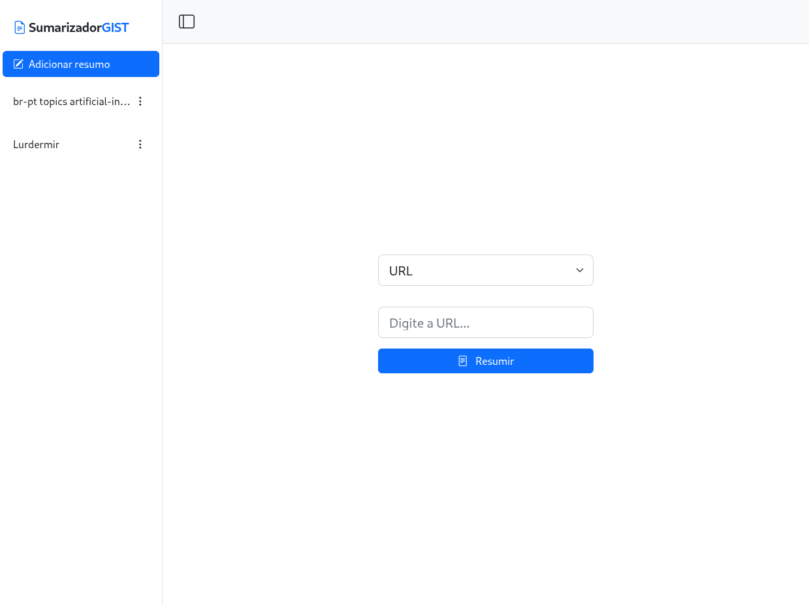
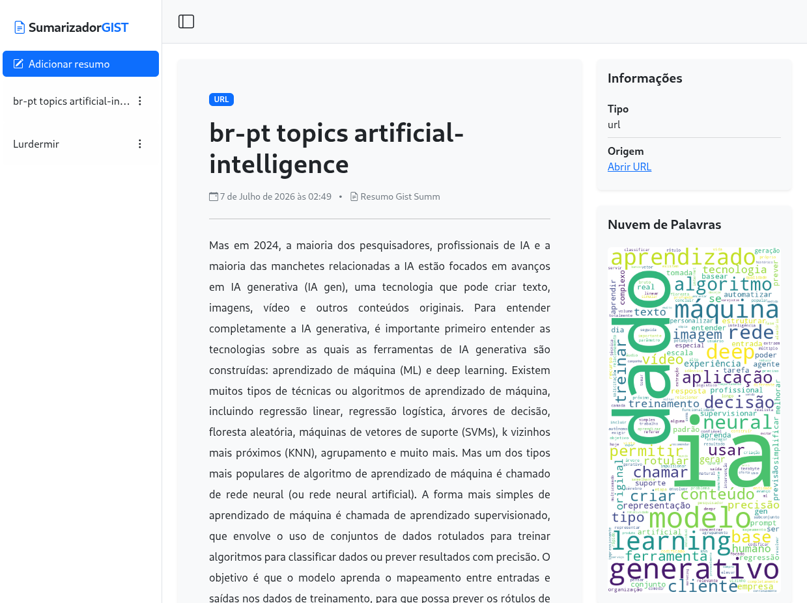

[LICENSE__BADGE]: https://img.shields.io/github/license/gh-add/SumarizadorGIST?style=for-the-badge
[PYTHON_BADGE]: https://img.shields.io/badge/Python-3.11.9-blue?style=for-the-badge&logo=python&logoColor=lightskyblue
[DJANGO_BADGE]: https://img.shields.io/badge/Django-092E20?style=for-the-badge&logo=django&logoColor=green
[JAVASCRIPT__BADGE]: https://img.shields.io/badge/Javascript-000?style=for-the-badge&logo=javascript

<h1 align="center" style="font-weight: bold;">SumarizadorGIST</h1>

<div align="center">

![license][LICENSE__BADGE]
![python][PYTHON_BADGE]
![django][DJANGO_BADGE]
![javascript][JAVASCRIPT__BADGE]

</div>

<p align="center">
 <a href="#started">Sobre</a> •
 <a href="#tech">Tecnologias</a> • 
 <a href="#run">Como rodar o projeto?</a> •
 <a href="#license">Licença</a>
</p>

<h2 id="started">Sobre</h2>

<p align="center">
    <a href="projeto/img/index.png" target="_blank">
        
    </a>
    <a href="projeto/img/detail.png" target="_blank">
        
    </a>
</p>

<p align="justify">
  A ferramenta SumarizadorGIST foi construída com o objetivo de oferecer uma solução web capaz de gerar resumos de arquivos PDF e URLs utilizando técnicas de mineração de dados e Processamento de Linguagem Natural, com apoio de bibliotecas como spaCy, NLTK e Sentence Transformers, baseada no algoritmo GistSumm descrito na tese <a href="https://doi.org/10.22456/2175-2745.47524">Comparativo entre o algoritmo de Luhn e o algoritmo GistSumm para sumarização de Documentos (Muller, Granatyr, Lessing, 2015)</a>. Além disso, a ferramenta gera uma nuvem de palavras a partir do resumo produzido.
</p>

<h3>Funcionalidades</h3>

- Sumarização automática de arquivos PDF e conteúdo de páginas web via URL
- Geração de nuvem de palavras 
- Processamento assíncrono em segundo plano, sem bloquear a navegação do usuário
- Atualização em tempo real do status do processamento via Server-Sent Events (SSE)

<h2 id="tech">Tecnologias</h2>

**Backend**
- Django

**Processamento de Linguagem Natural**
- spaCy
- NLTK
- Sentence Transformers
- scikit-learn

**Extração de conteúdo**
- PyMuPDF (fitz) — extração de texto de arquivos PDF
- BeautifulSoup4 — extração de conteúdo de páginas web

**Dados e visualização**
- NumPy
- WordCloud

**Frontend**
- JavaScript

<h2 id="run">Como rodar o projeto?</h2>

Para rodar o projeto localmente, você vai precisar dos itens abaixo.

<h3>Pré-requisitos</h3>

- [Python 3.11+](https://www.python.org/downloads/)
- [Git](https://git-scm.com/downloads)

<h3>Clonar repositório</h3>

Clone o projeto para sua máquina:

```bash
git clone https://github.com/gh-add/SumarizadorGIST
```

<h3>Configurando o ambiente</h3>

Entre na pasta do projeto e crie um ambiente virtual, isolando as dependências do Python do restante do sistema:

```bash
cd {caminho_do_projeto}

# Cria o ambiente virtual
python -m venv venv

# Ativa o ambiente virtual (Linux/macOS)
source venv/bin/activate
# No Windows, use: venv\Scripts\activate
```

<h3>Instalando as dependências</h3>

Com o ambiente virtual ativado, instale as bibliotecas necessárias:

```bash
# Atualiza o gerenciador de pacotes do Python
pip install --upgrade pip

# Instala todas as dependências listadas no projeto
pip install -r requirements.txt

# Baixa o modelo de linguagem em português usado pelo spaCy
python -m spacy download pt_core_news_sm
```

<h3>Configurando o banco de dados</h3>

Crie as tabelas necessárias no banco de dados local (SQLite, por padrão):

```bash
# Gera os arquivos de migração com base nos models do projeto
python manage.py makemigrations

# Aplica as migrações, criando as tabelas no banco de dados
python manage.py migrate
```

<h3>Rodando o servidor</h3>

Inicie o servidor de desenvolvimento do Django:

```bash
python manage.py runserver
```

O projeto estará disponível em [http://localhost:8000/](http://localhost:8000/).

<h2 id="license">Licença</h2>

O software está disponível sobre a seguinte licença:

- [MIT](https://github.com/gh-add/SumarizadorGIST/blob/main/LICENSE)